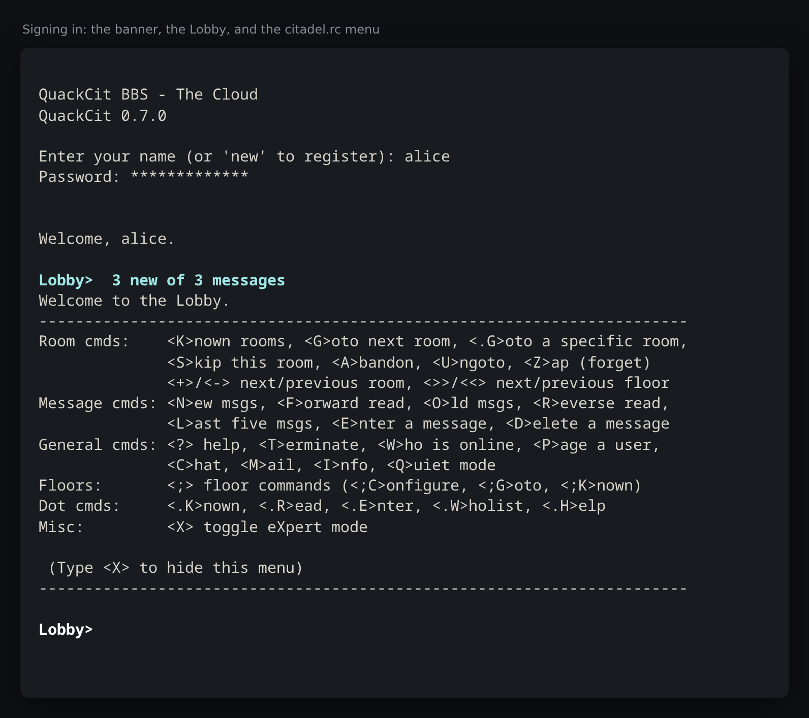
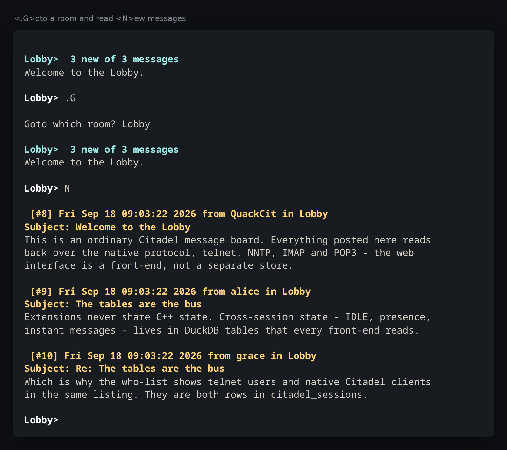
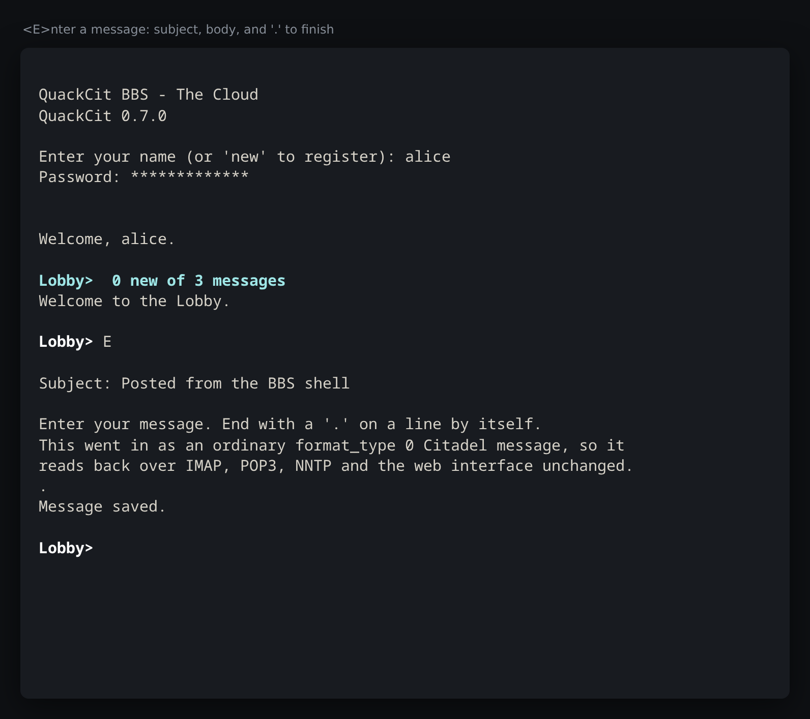

# The BBS

The native Citadel protocol, the server-side text client a plain
`telnet` reaches, and the two other protocols that read the same rooms.

## Native Citadel protocol

`quackmail_citadel` implements a useful subset of the Citadel client/server
protocol (stateful, 3-digit result codes, pipe-delimited params, `000`-terminated
listings):

- **Session**: greeting, `NOOP`, `ECHO`, `IDEN`, `QUIT`, `LOUT`, `INFO`.
- **Auth**: `USER`/`PASS`, `NEWU` (create + log in), `SETP` (set password).
- **Users**: `LIST` (directory, honouring `US_UNLISTED`), `REGI`/`GREG`
  (registration), `EBIO`/`RBIO` (biography) — the same records the BBS shell
  and the web console read and write.
- **Floors**: `LFLR` (list), `CFLR` (create, aide).
- **Rooms**: `LKRA`/`LKRN`/`LKRO` (list all/new/old), `GOTO`, `CRE8`, `KILL`,
  `GETR`/`SETR`, `RINF`, `SLRP` (set last-read).
- **Messages**: `MSGS` (`all`/`new`/`old`/`last`/`first`/`gt`/`lt`), `MSG0`
  (field listing), `MSG2` (raw), `ENT0` (post).

Config-heavy admin verbs (`CONF`, `DOWN`, `SCDN`, `TERM`, `EXPI`), the Citadel
network mesh, and instant messaging are deferred (see Roadmap).

## The BBS shell (telnet)



A real Citadel install has no telnet listener: the BBS experience comes from the
`citadel` text client speaking the native protocol. `quackmail_telnet` *is* that
client, running server-side, so a plain `telnet` gets the BBS — registration and
login, the `<Room>>` prompt, and the menu from `citadel.rc`:

```
telnet localhost 2300
```
```
QuackCit BBS - The Cloud

Enter your name (or 'new' to register): alice
Password:

Lobby>  1 new of 1 messages
Room cmds:    <K>nown rooms, <G>oto next room, <.G>oto a specific room, ...
```

Rooms: `<K>`nown, `<G>`oto (marks the room read and moves on), `<S>`kip (moves
on and leaves it unread), `<A>`bandon, `<U>`ngoto, `<Z>`ap to forget a room,
`<+>`/`<->` next/previous room and `<>>`/`<<>` next/previous floor.
Messages: read `<N>`ew/`<O>`ld/`<F>`orward/`<R>`everse/`<L>`ast five, `<E>`nter,
`<D>`elete. General: `<W>`ho, `<P>`age, `<M>`ail, `<I>`nfo, `<Q>`uiet mode,
`<X>` expert mode, `<?>` help, `<T>`erminate.

`;` opens the floor commands (`;C`onfigure floor mode, `;G`oto, `;S`kip to,
`;Z`ap, `;K`nown, and `;A`dmin create/edit/kill for aides). `.` opens the rest
of the `citadel.rc` menu: `.K`nown with filters (`.KZ`apped, `.KD`irectory,
`.KP`rivate, `.KR`ead-only, `.KM`atch, `.KF`loors), `.R`ead (`user list`, `bio`,
`configuration`, `system info`), `.E`nter (`password`, `configuration`,
`registration`, `bio`, a new `room`), `.W`holist (long, stealth) and, for aides,
`.A`dmin (edit/kill room, info file, move a message, edit/delete/validate
users).





Preferences persist in `citadel_users.flags` using Citadel's own `US_*` bits, so
expert mode, floor mode and the paginator survive a disconnect — and the web
console's preferences page edits exactly the same column. The screen size comes
from the telnet NAWS negotiation, and listings pause at each screenful.

Sessions register in `citadel_sessions`, so telnet users and native Citadel
clients see each other in the who-list and can page one another.

## News (NNTP)

Every room a user can see is a newsgroup, using Citadel's own name mapping
(`Lobby` → `ctdl.lobby`, `Global Address Book` → `ctdl.global+20address+20book`,
`0000000002.Mail` unchanged), and the room's message pointers are the article
numbers. `LIST ACTIVE/NEWSGROUPS/OVERVIEW.FMT` (with wildmat patterns), `GROUP`,
`LISTGROUP`, `ARTICLE`/`HEAD`/`BODY`/`STAT`, `NEXT`/`LAST`, `OVER`/`XOVER`,
`NEWGROUPS`, `DATE`, `AUTHINFO`, and `STARTTLS` are implemented.

Unlike a stock Citadel server, which answers `POST` with
`500 I'm afraid I can't do that.`, QuackCit **accepts posted articles**: they are
stored as ordinary Citadel messages, so an article posted over NNTP is readable
from a Citadel client, the BBS shell, IMAP and POP3. (It also resolves
`<message-id>` fetches and reports real `:bytes`/`:lines` in `OVER`, both of
which Citadel punts on.)

## Instant messaging (XMPP)

`quackmail_xmpp` speaks client-to-server XMPP: STARTTLS, SASL `PLAIN` (and the
legacy `jabber:iq:auth`), resource binding, sessions, `jabber:iq:roster`,
presence, `vcard-temp`, `urn:xmpp:ping` and service discovery.

Like Citadel, there is no stored roster: **the roster and presence list are the
people currently logged in** — read from `citadel_sessions`, so XMPP clients,
telnet users, native Citadel clients and anyone signed in to the web interface
all see one another. A `<message>` is written to `citadel_express`, the same
queue the native protocol's `SEXP`/`GEXP` uses, and queued messages are pushed
to connected XMPP clients as `<message>` stanzas. Sending from XMPP and reading
with `GEXP` from a Citadel client, from the BBS shell, or in a browser at
`/chat` works in every direction: there is one queue, and it is a table.

A browser is a presence row like any other — see
[Who is online](web.md) — which also means a `citadel_sessions` row now has to
be *reaped* rather than only unregistered. A front-end that declares a
heartbeat is held to it; one that cannot (a telnet session blocked in a read
has no timer) unregisters on a clean disconnect and is otherwise swept after
`qm_session_stale_secs`.
