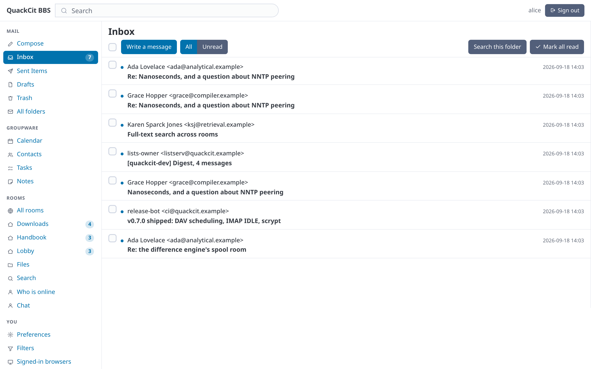
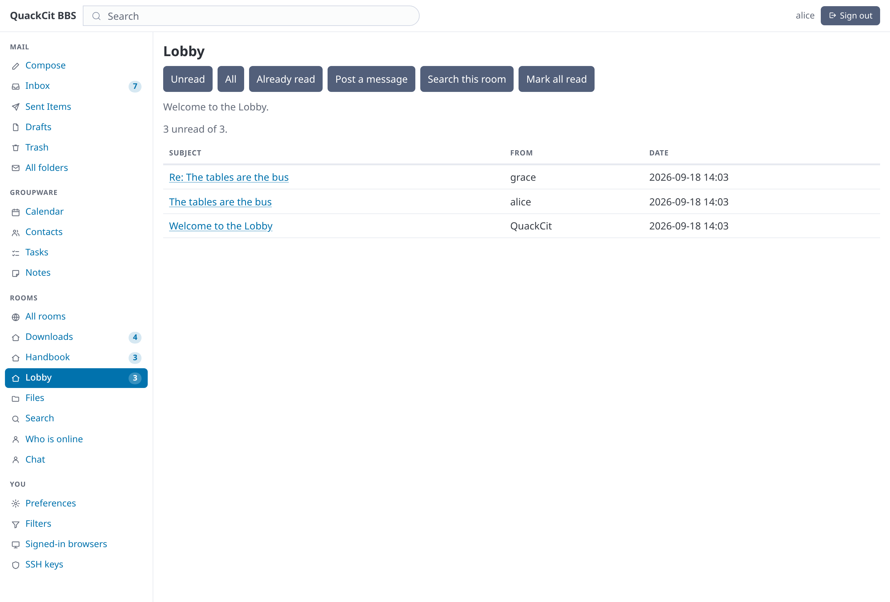
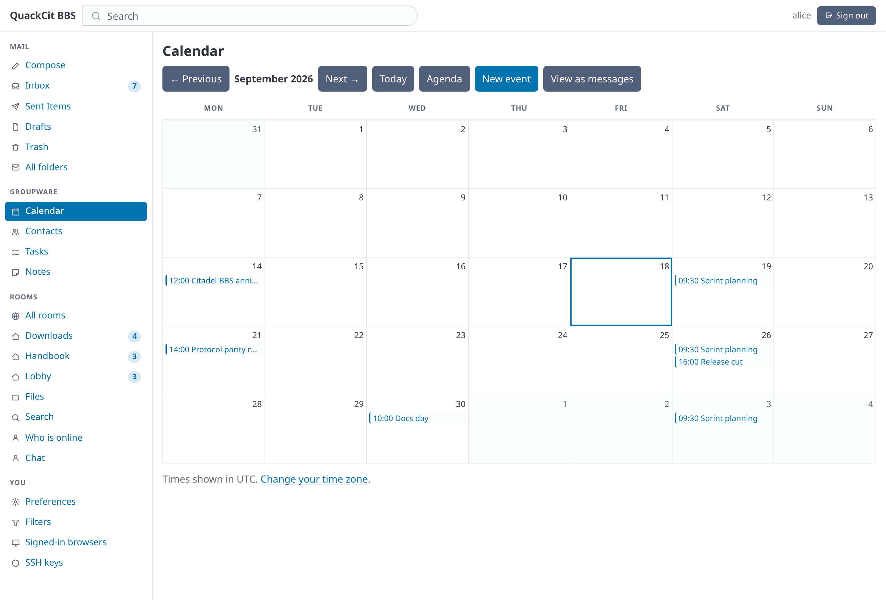
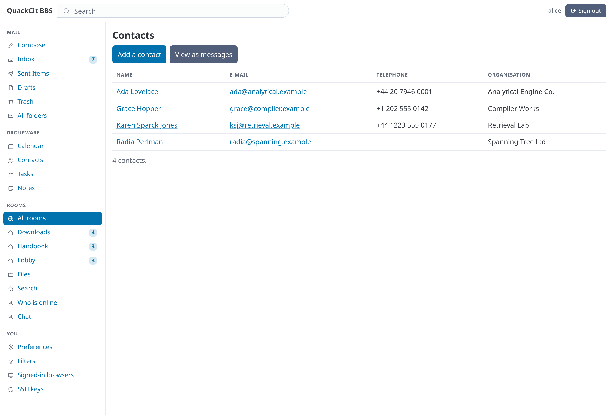
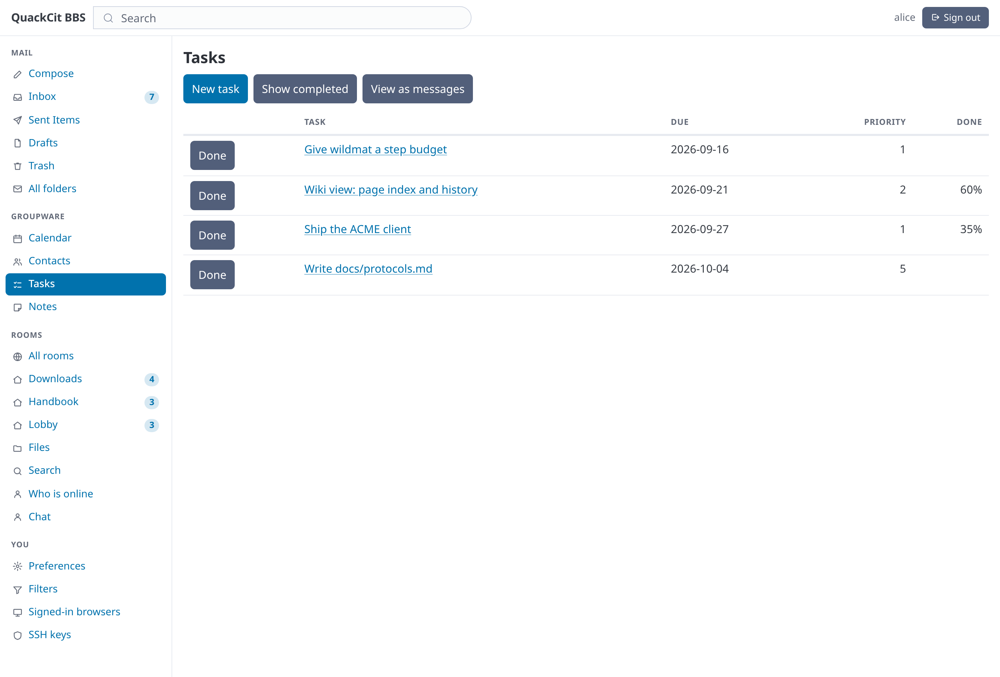
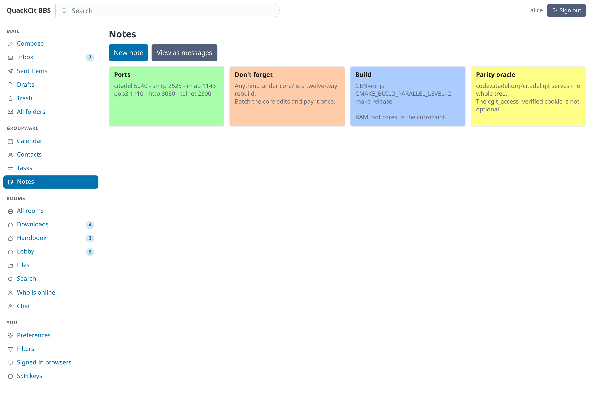
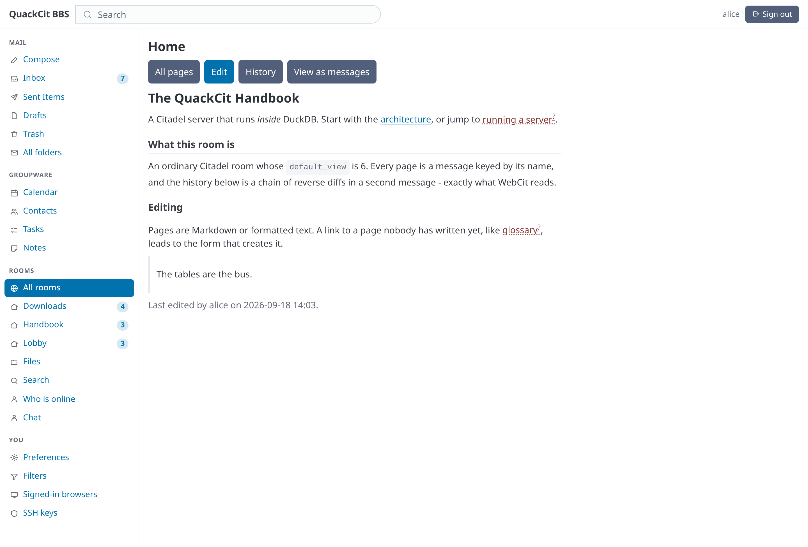
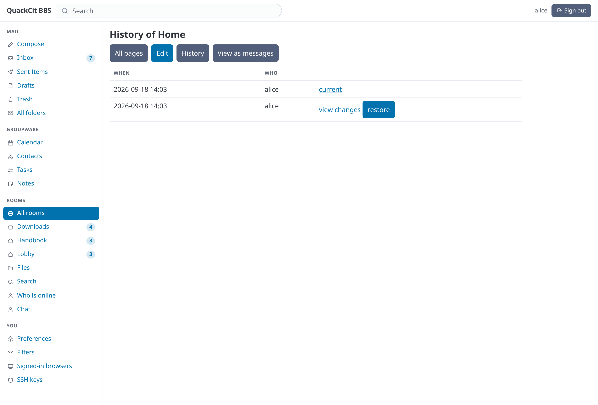
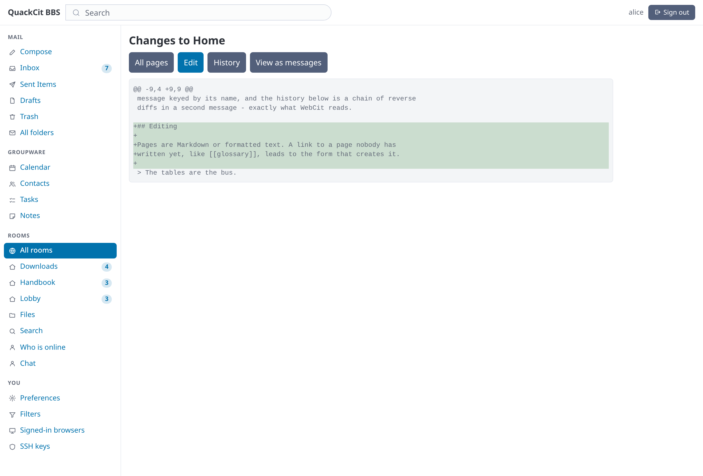

# The web interface

Webmail, the BBS, the groupware room views, and the security posture of
the only part of QuackCit a browser can reach.



Every image on this page is a real capture of a running server, generated by
[`tools/screenshots.py`](../tools/screenshots.py); the whole set is in
[`screenshots/`](../screenshots/README.md).

## The web interface (HTTP/HTTPS)

`quackmail_http` serves three things from one listener pair — `qm_http`
(80; dev 8080) and `qm_https` (443; dev 8443, implicit TLS):

- **Webmail** at `/mail/` — the user's personal rooms as folders, a paged
  message list, a read pane with attachments, and compose/reply/reply-all/
  forward. Sending goes through the *same* path as SMTP submission: the send
  quota is checked first, the message is DKIM-signed once, local recipients are
  delivered and remote ones queued, and a copy is filed into Sent Items.

  A folder is a `VIEW_MAILBOX` room and renders as a **two-pane mailbox**: the
  listing on the left, the message being read on the right, each scrolling on
  its own. Opening a message is a real URL — `?open=<msgnum>` renders both
  halves — so it is linkable and the browser history works; htmx then fetches
  that same URL and swaps only the reader, which is what keeps the list from
  jumping back to the top. The server chooses between the two from the
  `HX-Request` header, so a plain `GET` always returns the whole page.

  Each row carries a checkbox, an unread dot, flag and attachment glyphs, the
  correspondent, the date and the subject; the bulk bar below files, flags,
  marks read or deletes **whatever is ticked**. It is one `<form>` with a
  `formaction` per button, which is simply the shortest correct way to post one
  set of checkboxes to six endpoints.

  Below the sidebar breakpoint the panes become one — opening a message replaces
  the list, and the reader carries the way back.

  Read state in a folder is the IMAP `\Seen` flag, not the Citadel last-read
  pointer the message board uses: a pointer is a high-water mark and cannot say
  "this one, not that one". Opening a message sets it, and it is the same
  `citadel_msg_flags` row a desktop client reads, so the two agree.

  **Compose** docks into the reading pane rather than replacing the mailbox:
  *Write*, *Reply*, *Reply all* and *Forward* fetch `/mail/compose` and swap it
  into the reader, and the same URL still renders a whole page for a plain
  browser and for a link somebody pasted. To, Cc and **Bcc** are recipient
  chips over an ordinary comma-separated field, so the field the server reads
  is the same one it has always read; an address that cannot be delivered
  anywhere is marked rather than refused, because a bare local user name is a
  legal recipient here and the browser cannot know the roster. The address book
  is searched on the server (`/mail/addressbook?q=`) instead of the whole book
  being inlined into every compose page.

  A **draft** can be resumed (`/mail/compose?draft=<msgnum>`), autosaves once a
  minute, and replaces itself rather than accumulating: the server answers
  `/mail/draft` with the number it kept, and the form follows it. Leaving with
  unsent text asks first. Bcc is stored on the draft and on the sender's own
  filed copy, and on nothing that goes out — a blind recipient is an envelope,
  not a header.

  A **reply** carries the parent's whole `References` chain plus its
  `Message-ID`, which is what makes a thread survive past its third message;
  reply-all keeps everyone the message was addressed to, minus the reader
  themselves. `Re:` is matched case-insensitively across the prefixes other
  languages use (`AW:`, `SV:`, `Re[2]:`), so they stop stacking. A **forward**
  attaches the original as `message/rfc822`, so the attachments that came with
  it go with it.

  Composing offers **formatted text**, producing a `multipart/alternative` with
  both halves so a recipient on a text-only client, or reading over Citadel or
  POP3, still gets something readable. A pasted or dropped image becomes a real
  `cid:` part rather than a base64 blob inside the body. The editor is 200 lines
  of `contenteditable` with no dependency, and whether it starts on is a
  preference rather than something the composer decides. A signature set in
  *Preferences* is appended to a new message and never to a resumed draft.

  Attachments are listed as they are chosen, each with its own way back off,
  and the 10 MB ceiling on a whole request is stated up front and checked
  before the POST — exceeding it is a connection-level rejection that would
  otherwise lose everything typed.

  Composed HTML is sanitized on the server against an **allow-list**, before the
  message is built — not on display. What is stored is already safe, because it
  will be re-served from this origin to the recipient, to everyone in a public
  room, and to every subscriber of a mailing list.


- **The BBS** at `/bbs/` — floors, rooms, reading, posting, replying, marking
  read, forgetting a room, the who-list and instant messages. A post made here
  is an ordinary `format_type = 0` Citadel message, so it reads back over the
  native protocol, telnet, NNTP, IMAP and POP3.
- **Chat** at `/chat` — instant messages, as a conversation rather than as a
  notification. Citadel `SEXP`, telnet, XMPP and the web all read and write the
  same `citadel_express` queue, so a page sent from a telnet session arrives in
  a browser and vice versa. Until this existed the web could page people and
  could never *be* paged: nothing on its side ever called `PendingExpress`, so
  a message sent to somebody reading their mail in a browser was simply never
  seen.

  Rows are retained rather than drained, which is what makes the page a
  transcript; `delivered_at` records when each one was actually read, and
  `qm_express_days` (default 30) sweeps the rest. The log polls
  `/chat/feed?since=<token>` every `qm_chat_poll_secs` seconds and a quiet poll
  answers `204` — one indexed `max(id)`, no body, and the caret in the message
  box does not move. **The honest cost:** one thread per connection and a
  five-second poll keeps that connection alive, so `qm_http_max_connections`
  (default 256) is also the ceiling on open chat tabs.
- **Who is online** at `/bbs/who` now includes browsers. HTTP has no connection
  to anchor presence to, so the browser session is the anchor: a
  `citadel_sessions` row is registered the first time a signed-in request is
  seen, heartbeated once a minute, and dropped when that session is revoked —
  which is why signing out of one browser does not evict the other two. A
  front-end that declares a heartbeat is held to it and swept within a few
  minutes of going quiet; one that cannot (a telnet session blocked in a read
  has no timer) is swept after `qm_session_stale_secs`, default a day. Before
  this there was no reaping at all, and a crashed front-end leaked a row that
  survived restarts.
- **The sidebar** carries unread counts: every mail folder, and the rooms with
  something new in them, most unread first. It is one room listing plus one or
  two `RoomStatsBulk` calls — fewer queries than the four `FindUserRoom` lookups
  it used to make for the groupware links, which now come out of the same
  listing. `qm_web_sidebar_rooms` (default 10) caps the room half and 0 turns it
  and its query off; folder counts are a handful of personal rooms and always
  shown. A room page marks that room current, falling back to *All rooms* for
  one the sidebar does not list.
- **Reading is a flow**, not a round trip through the list: *Newer*, *Older* and
  *Next unread* sit above every message. Each is a bounded min/max over the
  `(room_num, msgnum)` key rather than a listing of the room, and *next unread*
  means what that room's own listing means — `\Seen` in a mail folder, the
  last-read pointer on a board.
- **Search** at `/search`, and from the box in the page header. Subject and
  sender are matched across every room the caller can read; message text is a
  second mode, because a body is not a column — a `format_type = 4` message
  keeps its text base64-encoded inside `raw`, so matching it means decoding each
  candidate through the same `citadel::BodyText` the other front-ends use. That
  path is bounded by `qm_web_search_scan` (default 2000 messages, newest first)
  and the page says when it hit the bound rather than passing off a partial
  answer as a complete one.

  The room set *is* the access control: search enumerates rooms through the same
  helper the room list uses, so a private room stays invisible, a forgotten room
  stays forgotten, another user's mailbox is never reachable, and a passworded
  room is not searched until that session has unlocked it. A `room=` parameter
  naming a room outside that set is not a scope — it is ignored, never a query
  against that room.
- **Room views.** A room's Citadel `default_view` decides how it renders:

  
  
  
  


  | View | What you get |
  |---|---|
  | `Contacts` | an address book; each e-mail address is a link that composes to it |
  | `Calendar` | a month grid, or an agenda for `CALBRIEF`; the day number creates an event |
  | `Tasks` | VTODO with due date, priority and progress, sorted as a work queue |
  | `Notes` | a card grid of `text/vnote` sticky notes, colours and all |
  | `Blog`, `Journal` | whole entries newest-first rather than a list of subjects |
  | `Wiki` | pages by name, with history, diffs and revert — see below |
  | anything else | the ordinary message list |

  `?view=raw` forces the message list for *any* room, which is what you want the
  first time a Contacts room turns out to hold something that is not a vCard.

### Wiki rooms



A room whose `default_view` is `Wiki` (6) holds **pages addressed by name**
rather than messages addressed by number. A page is still an ordinary
`format_type = 4` message — its euid is the normalized page name — so it reads
back over IMAP and the native protocol like everything else here.

Page names are normalized the way WebCit normalizes them: every byte below 0x20
or above 0x7F becomes `_`, then ASCII lowercase. A space survives as a space, so
`Front Page` and `front page` are the same page and both display as typed. An
empty name means `home`.

A page is written in **Markdown** (`text/x-markdown`) or **formatted text**
(`text/html`); the format is a property of the page, not of the room, and both
work in the same room. Markdown is stored as source and rendered on the way out
— so the editor always shows what you wrote, not a round-trip through generated
markup. Raw HTML inside Markdown is escaped rather than passed through, and the
rendered result still goes through the same allow-list sanitizer the composer
uses. `[[Wiki Links]]` resolve within the room; a link to a page nobody has
written yet is marked and leads to the form that creates it.

**History is Citadel's**, not ours. Every edit writes a reverse unified diff
into a companion message whose euid is `<page>_HISTORY_`, newest first, each
part carrying a base64 memo of the previous revision's message number, time and
author. That is exactly the layout
`citadel/server/modules/wiki/serv_wiki.c` writes, so history written here is
readable by WebCit and by the Citadel clients — and `WIKI history|<page>` and
`WIKI rev|<page>|<rev>|showrev` serve it over the native protocol for them.




Restoring an old revision is recorded as a new revision rather than as a rewrite
of history, so it is itself undoable. An edit that changes nothing is refused
rather than stored as an empty change set, which is what Citadel does and what
keeps the chain replayable.

  Contacts, calendar entries, tasks and notes are ordinary `format_type = 4`
  messages wrapping one `text/vcard`, `text/calendar` or `text/vnote` part and
  keyed by the object's own UID — so an object created in the browser is a
  readable MIME message over IMAP with no extra code, and saving it again
  replaces it rather than appending a copy. Blog and journal rooms hold plain
  messages, so an entry reads back over every other protocol as itself.

  Editing preserves what the forms do not show. A calendar event keeps the alarm
  someone set on their phone, a contact keeps a second address, a note keeps
  where another client placed it on a pinboard.
- **Room settings** at `/bbs/room/:n/settings` — not part of the admin console.
  The page is gated on the RFC 4314 `a` ("administer") right, so an aide hands
  somebody a room by granting it and that person manages the room without ever
  reaching `/admin`, which is root-equivalent. The grant can be made from that
  page, from `quackcitadm.sh room acl`, or from any mail client:

  ```
  a1 SETACL "Project X" alice lrswia                  # alice now runs that room
  ```

  ```sh
  quackcitadm.sh room rights "Project X" alice        # what alice may actually do
  ```

  A room's administrator sets its name, floor, view, description and flags;
  edits its access list; opens or closes its `room_<name>@` address; runs its
  mailing list's presentation and membership; polls a feed pointed at it; and
  deletes it. Two things stay an operator's, and the page says why: **creating**
  a feed (it stores a plaintext password and dials whatever host it names) and
  **making** a room into a mailing list (that mints an inbound address and a
  fan-out engine). Inviting a subscriber sends a confirmation and nothing else,
  so a room administrator cannot sign up an address nobody reads.
- **Creating a room** at `/bbs/new`, gated on `qm_room_create_axlevel` — the
  Citadel access level it takes, defaulting to aide (6) so nothing changes on an
  existing server until an operator lowers it. Whoever creates a room
  administers it. An invitation-only room is listed only for the people its
  access list names with `l`, which is what makes "private" mean invitation
  rather than merely name-guessing.
- **The admin console** at `/admin/` — users, rooms, floors and `citadel_config`,
  plus the whole mail-policy set (domains, aliases, ACLs, DNSBL zones, DKIM
  keys, send quotas), the inbound audit log, the outbound queue, any user's
  Sieve scripts, and the signed-in browsers.

Everything is **server-rendered HTML** — still no build step and no CDN, and
every route returns a complete page. There are two vendored dependencies:

| File | Version | Licence |
|---|---|---|
| `http/assets/pico.css` | Pico CSS v2.1.1 | MIT |
| `http/assets/htmx.min.js` | htmx 2.x | Zero-Clause BSD |

Both were fetched once by hand and committed, on the same terms as
`core/src/psl_data.cpp`: the build fetches nothing, so it works offline, and
their CVEs are ours to track. Neither can carry a `LICENCE` file beside it —
`tools/gen_assets.py` serves *every* file in `http/assets/` and refuses any
extension outside its MIME table — so Pico's licence lives in its own banner and
this table is the record for both.

Assets are compiled into the extension and served from memory:
`tools/gen_assets.py` turns the files in `http/assets/` into a committed C++
source file, so there is no data directory to install. Their URLs carry a
content hash (`/static/qc.9f3a1c2b.css`), which is what lets them be cached
`immutable` for a year — a changed file is a changed URL, so there is never a
stale copy and never a cache to bust. Nothing on the wire is compressed, so
those bytes are the real cold-load cost; they are paid once per release.

The stylesheet arrives in **three blocks, and the order is the design**:

1. an inlined skeleton — a fallback palette and the layout grid, at plain
   `:root` specificity, so a page has a shape on the first packet and stays
   legible if `/static` is unreachable behind a proxy;
2. `pico.css` and `qc.css`, which override every one of those fallbacks;
3. the per-user colour theme, inlined, because a `:root` override that varies
   per user cannot be a cacheable file — and because it has to win.

Putting the skeleton *after* the sheets instead would silently defeat Pico's own
palette.

**JavaScript is assumed.** That was not always true: until the interface was
rebuilt, every page was required to work with scripting off, which is what
shaped the select-all checkbox that hid itself and the composer that degraded to
a bare textarea. Pages are still rendered whole by the server — that is what
keeps a URL meaningful, keeps the integration tests able to drive the app with
`urllib`, and makes the htmx fragment negotiation above a two-line decision —
but the interface is no longer designed around scripting being absent.

**Listings sort, move and resize.** A table declares its columns once — key,
heading, cell class — so the heading a phone reads off `data-label` is the
heading by construction rather than by every call site remembering to pass the
same string twice. (It mostly did not: `data-label` appeared at five sites in a
tree with thirty-six tables, so almost every listing rendered as unlabelled
cards on a phone.)

Sorting is **server-side** (`?sort=<key>&dir=asc|desc`, with `aria-sort` on the
active header), because the listings that need it page before they load their
rows: sorting the rendered page would reorder twenty results out of two hundred
and call it a sort. Column **order and width** are the reader's rather than the
account's, so they are client-side and live in `localStorage` under the table's
own id; a browser that has never touched a table gets exactly what the server
sent. Both are off below the card breakpoint, where a reordered column means
nothing. Double-clicking a resize grip hands the column back to the browser.

Connections are persistent, since a page is now several requests — see
[Security posture](#security-posture) for the limits that bound them.

### Security posture

The web front-end is the only part of QuackCit a browser can reach, so it is
the part with the most deliberate hardening. Read that in the light of the
[disclaimer](../README.md#quackcit) at the top: none of it has been reviewed by anyone, and
the two items marked **relaxed by default** are the price of a fresh install
being reachable at all.

- **HTTPS is not forced on a fresh install** — *relaxed by default*. The plain
  listener can redirect everything to `https://<c_fqdn>`, built from the
  configured name and never from the client's `Host` header, because using the
  header there would be an open redirect with extra steps. But that redirect
  carries no port, so on the default dev ports (8080/8443) it sends browsers to
  a closed one; the first `quackcit.sh start` therefore writes
  `qm_web_force_https = 0` and the interface is served in the clear. Set it back
  to `1` once you have a certificate clients trust, or behind a reverse proxy
  listed in `qm_web_trusted_proxies` — `X-Forwarded-Proto` is honoured only from
  a peer on that list. Sessions are pinned to the transport they were minted
  over either way, so nothing is laundered between the two listeners.

  One thing does build a URL from the `Host` header, and the difference is
  worth stating rather than leaving as an apparent inconsistency: JMAP's
  Session resource (`apiUrl`, `uploadUrl`, `downloadUrl`). A client calls those
  verbatim instead of resolving them against the request the way it resolves a
  DAV href, so a path is not a URL there — and `c_fqdn` carries no port, which
  would describe every server not on 80/443 wrongly. A `Location` is followed
  by a browser and can be cached; these go back to the authenticated client
  that just sent the header, on the same connection, in a `no-store` response,
  for that client to call us on. The header is still validated to
  `host[:port]` and falls back to `c_fqdn` otherwise, and `qm_web_base_url`
  overrides the whole thing for a reverse proxy that rewrites `Host`.
- **Form origins are unrestricted until you restrict them** — *relaxed by
  default*. `qm_web_origins` is a comma-separated list of host globs allowed to
  submit forms; while it is empty, any origin may. This server is reached by
  whatever name its operator points at it — a LAN address, a container name, a
  tunnel — and the previous behaviour of falling back to `c_fqdn` meant every
  deployment whose `c_fqdn` was not exactly the browsed name rejected all of its
  own POSTs with *"This form was submitted from another site"*. The CSRF
  synchronizer token below is the actual cross-site defence; the origin check is
  a cheap second one, and setting `qm_web_origins` is what turns it on.
- **The admin console is off until you turn it on** (`qm_web_admin_enabled`),
  requires TLS (`qm_web_admin_require_tls`), honours the `webadmin` ACL scope
  for a network allow-list, and asks for the operator's own password again
  before creating accounts, resetting passwords, writing config or generating
  DKIM keys. Reaching it is equivalent to root on the host.
- **Sessions** are 32 random bytes in an `HttpOnly; SameSite=Lax` cookie;
  only the SHA-256 is stored, so the database never holds anything replayable.
  A session is **pinned to the transport it was minted over**, in both
  directions, so a cookie cannot be laundered between the plaintext and TLS
  listeners. Changing a password revokes every session for that account.
- **CSRF** uses a synchronizer token derived from a server secret, checked in
  the router rather than in each handler, so a new POST route cannot forget it.
- **Message bodies are attacker-controlled** — they arrive over SMTP. Text is
  escaped at every interpolation (decoded first, escaped second, so an RFC 2047
  encoded-word cannot decode back into a tag). A `text/html` part is sanitized
  and then served from its own route into a `sandbox`ed iframe under
  `default-src 'none'`, with remote images blocked until the reader asks for
  them. Attachments are always `application/octet-stream` with
  `Content-Disposition: attachment` and `nosniff`, never the sender's type.
- Every page carries a CSP with a per-response nonce **and** `'self'` (no
  `'unsafe-inline'` anywhere), `nosniff`, `X-Frame-Options: DENY`,
  `Referrer-Policy: no-referrer` and `Cache-Control: private, no-store`.
  `'self'` is what lets `/static` be used; the frame a **message body** is
  rendered into deliberately does not get it, since that markup came from
  whoever sent the mail.
- **Connections are persistent, and bounded.** Up to 100 requests per
  connection, a 5-second idle deadline between them, a 60-second ceiling on the
  connection, and at most `qm_http_max_connections` (default 256) open at once.
  The *first* request on a connection still gets the full 15-second header
  deadline, which is the slow-loris defence. Any malformed or oversized request
  closes the connection rather than answering and continuing: a 413 or 411 is
  sent without reading the body the client announced, so those bytes are still
  on the wire and reusing the socket would parse them as the next request.
- Rooms and messages are addressed by number and re-checked on every request:
  a room is resolved through the visibility rules, and a message number is
  verified to be pointed into that room before it is loaded.

Failed sign-ins are counted per client address and answered with a `429` once
they pile up; the wrong-user and wrong-password replies are identical, so the
form cannot be used to enumerate accounts.
